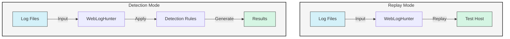

# WebLogHunter

WebLogHunter is a powerful tool for analyzing and replaying web server logs, designed to help security professionals and developers identify potential HTTP attacks and suspicious activities in web server logs.

[English](README.md) | [简体中文](README_CN.md)

## Workflow




## Features

- **Log Replay**: Replay HTTP requests from log files to test server responses
- **Attack Detection**: Identify potential security threats using customizable rules
- **Multiple Log Formats**: Supports common web server log formats (Nginx, Apache, etc.)
- **Custom Rules**: Define your own detection rules for specific attack patterns
- **Performance Testing**: Stress test your web applications by replaying real traffic

## Installation

### Prerequisites
- Go 1.16 or higher

### Using Go Install
```bash
go install github.com/martin2877/webloghunter@latest
```

### Building from Source
```bash
git clone https://github.com/martin2877/webloghunter.git
cd webloghunter
go build -o webloghunter
```

## Usage

### Web Log Replay
Replay HTTP requests from log files to a target server:

```bash
# Basic usage
webloghunter replay -l /path/to/access.log -t http://target-server
```

### Web Log Detection
Analyze logs for potential security threats using built-in or custom rules:

```bash
# Basic detection
webloghunter detection -l /path/to/access.log

# With custom rules file
webloghunter detection -l access.log -c rules.custom.yaml
```

## Configuration

Create a `config.yaml` file to customize WebLogHunter's behavior:

```yaml
# rules.yaml
attackregex:
  - id: 1
    regex: '.*xwork\.MethodAccessor.*'
    place: 'url'
    typename: 'Exploit Pattern'
    level: 3
    leveldesc: 'High Severity Threat'
    actiondesc: 'Struts2 Remote Code Execution Vulnerability'

scannerregex:
  - regex: '.*?HTTrack.*?'
    typename: 'HTTrack'
```

## Contributing

Contributions are welcome! Please feel free to submit a Pull Request.

## License

This project is licensed under the MIT License - see the [LICENSE](LICENSE) file for details.

