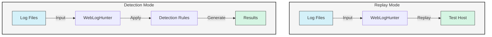

# WebLogHunter 网络日志分析工具

WebLogHunter 是一个功能强大的网络服务器日志分析和重放工具，专为安全专业人员和开发人员设计，用于识别 Web 服务器日志中的潜在 HTTP 攻击和可疑活动。

## Workflow



## 功能特点

- **日志重放**：重放日志文件中的 HTTP 请求以测试服务器响应
- **攻击检测**：使用可自定义规则识别潜在安全威胁
- **多格式支持**：支持常见 Web 服务器日志格式（Nginx、Apache 等）
- **自定义规则**：为特定攻击模式定义自己的检测规则
- **性能测试**：通过重放真实流量对 Web 应用进行压力测试

## 安装指南

### 环境要求
- Go 1.16 或更高版本

### 使用 Go Install 安装
```bash
go install github.com/martin2877/webloghunter@latest
```

### 从源码构建
```bash
git clone https://github.com/martin2877/webloghunter.git
cd webloghunter
go build -o webloghunter
```

## 使用说明

### 网络日志重放
将日志文件中的 HTTP 请求重放到目标服务器：

```bash
# 基本用法
webloghunter replay -l /path/to/access.log -t http://target-server
```

### 网络日志检测
使用内置或自定义规则分析日志中的潜在安全威胁：

```bash
# 基本检测
webloghunter detection -l /path/to/access.log

# 使用自定义规则文件
webloghunter detection -l access.log -c rules.custom.yaml
```

## 配置说明

创建 `config.yaml` 文件来自定义 WebLogHunter 的行为：

```yaml
# rules.yaml
attackregex:
  - id: 1
    regex: '.*xwork\.MethodAccessor.*'
    place: 'url'
    typename: 'Exploit特征'
    level: 3
    leveldesc: '高危级别威胁'
    actiondesc: 'Struts2命令执行漏洞攻击'

scannerregex:
  - regex: '.*?HTTrack.*?'
    typename: 'HTTrack'
```

## 贡献指南

欢迎贡献代码！请随时提交 Pull Request。

## 许可证

本项目采用 MIT 许可证 - 详情请参阅 [LICENSE](LICENSE) 文件。